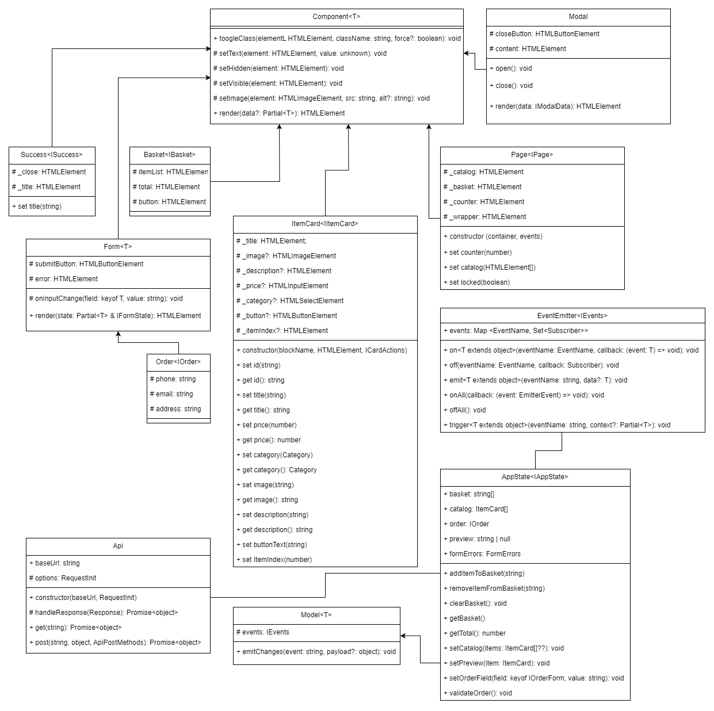

# Проектная работа "Веб-ларек"

Стек: HTML, SCSS, TS, Webpack

Структура проекта:
- src/ — исходные файлы проекта
- src/components/ — папка с JS компонентами
- src/components/base/ — папка с базовым кодом

Важные файлы:
- src/pages/index.html — HTML-файл главной страницы
- src/types/index.ts — файл с типами
- src/index.ts — точка входа приложения
- src/scss/styles.scss — корневой файл стилей
- src/utils/constants.ts — файл с константами
- src/utils/utils.ts — файл с утилитами

## Установка и запуск
Для установки и запуска проекта необходимо выполнить команды

```
npm install
npm run start
```

или

```
yarn
yarn start
```
## Сборка

```
npm run build
```

или

```
yarn build
```
## Описание архитектуры
Во взаимодействиях внутри приложения используются события. Модели создают события, которые затем перехватываются слушателями событий в основном коде. Эти слушатели передают данные компонентам отображения и выполняют необходимые вычисления, а также обновляют значения в моделях. В архитектуре приложения применяются принципы MVP.



## Базовые классы

### 1. Класс EventEmitter
Реализует паттерн "наблюдатель", предоставляя возможность подписываться на события и уведомлять подписчиков об их наступлении.

Его свойство `_events` является объектом `Map`, содержащим названия событий и соответствующие им колбэк-функции. Конструктор принимает экземпляр объекта `Map` и сохраняет его в свойстве `_events`.

Класс предоставляет методы `on`, `off`, и `emit`, которые используются для подписки на событие, отписки от него и уведомления подписчиков о его наступлении соответственно.

Кроме того, включены методы `onAll` и `offAll` для подписки на все события и удаления всех подписчиков.

Метод `trigger` позволяет генерировать события с заданными аргументами, чтобы передавать их как обработчики событий в другие классы. Эти классы смогут генерировать события, не будучи напрямую зависимыми от класса `EventEmitter`.

### 2. Класс Api
Отвечает за обмен данными с сервером.  
`constructor(baseUrl: string, options: RequestInit = {})` - конструктор принимает два параметра: `baseURL` — основной корневой адрес, и `options` — параметры для запросов(опционально). Эти значения сохраняются в свойствах объекта, включая заголовки.

Реализованы следующие методы:  
`handleResponse` — проверяет наличие ответа от сервера и декодирует его в формат JSON  
`get` — запрашивает данные с сервера  
`post` — отправляет данные на сервер

## Компоненты модели данных (бизнес-логика)
### 1. Класс Model\<T\>
Базовая модель, предназначенная для отличия от простых объектов с данными, является абстрактным классом с обобщенным типом `T`.  
`T` представляет собой тип данных, с которыми работает модель.

`constructor(data: Partial<T>, protected events: IEvents)`
Конструктор принимает следующие аргументы:  
`data: Partial<T>` - сами данные для обработки
`events: IEvents` - обработчики событий
Класс также включает метод:  
`emitChanges` - используется для генерации событий с передачей данных

### 2. Класс AppState
Управляет содержимым всего приложения и предоставляет покупателям доступ к функционалу сайта.
Не имеет своего конструктора - является наследником класса `Model` с дженерик типом `IAppState`.

Реализует следующие методы:  
`addItemToBasket` — добавляет товар в корзину, принимает объект товара  
`removeItemFromBasket` — удаляет товар из корзины, принимает объект товара  
`clearBasket` — очищает корзину  
`getBasket` — возвращает список товаров в корзине  
`getTotal` — вычисляет общую сумму заказа  
`setCatalog` — устанавливает каталог товаров, принимает массив объектов товаров  
`setPreview` — устанавливает предварительный просмотр товара, принимает объект товара  
`setOrderField` — при правильном заполнении всех данных заказа отображает окно с оформленным заказом  
`validateOrder` — проверяет корректность данных покупателя в заказе

## Компоненты представления
### 1. Класс Component\<T\>
Базовый компонент проекта, обеспечивающий работу с элементами DOM, используется в большинстве компонентов отображения.

`constructor(protected readonly container: HTMLElement)` - 
этот компонент параметризирован и принимает в конструкторе контейнер DOM-элемент для взаимодействия.

Он также предоставляет методы:  
`toggleClass` для переключения класса элемента  
`setText` для установки текстового содержимого  
`setHidden` и `setVisible` для скрытия или отображения элемента  
`setImage` для установки изображения  
`render` возвращает измененный DOM-элемент после внесения изменений
`setDisabled`сменяет статус блокировки

### 2. Класс ItemCard
Этот класс наследуется от класса `Component` и предназначен для отображения элемента товара. 

`constructor(protected blockName: string, container: HTMLElement, actions?: ICardActions)` - в конструкторе он принимает следующие параметры:  
`blockName` (название блока с карточкой)  
`container` (DOM-элемент)  
шаблон карточки и `actions` (функции для взаимодействия)  
Конструктор записывает конкретные DOM-элементы в свои свойства и устанавливает обработчик события на кнопку добавления в корзину.
Свойства класса (их тип - DOM-элементы):
`_title`: заголовок карточки товара  
`_description`: описание товара  
`_image`: картинка товара  
`_category`: категория товара  
`_price`: цена товара  
`_button`: кнопка для перемещения товара в корзину  
Также у класса есть сеттеры и геттеры для следующих свойств:  
`id`: устанавливает и получает id товара  
`title`: устанавливает и получает название товара  
`description`: устанавливает и получает описание товара  
`image`: устанавливает и получает картинку товара  
`category`: устанавливает и получает категорию товара  
`price`: устанавливает и получает цену товара

### 3. Класс BasketItem
Этот класс наследуется от класса `Card` и используется для установки индекса товара в корзине.

`constructor(container: HTMLElement, actions?: ICardActions)`  
Он наследует конструктор от родительского класса и добавляет свойство `_index` для хранения DOM-элемента, отображающего индекс.
Класс реализует сеттер `index`, который принимает число и устанавливает его как текст для индекса.

### 4. Класс Form\<T\>
Этот класс наследуется от класса `Component` и представляет собой компонент формы оплаты.

`constructor(protected container: HTMLFormElement, protected events: IEvents)`  
В конструкторе он принимает контейнер (HTML-элемент) и события для взаимодействия с компонентами. Затем он записывает конкретные DOM-элементы в свои свойства, вешает обработчик события `input` на поля и вызывает метод `onInputChange`. Кроме того, он также вешает обработчик на контейнер с формой и уведомляет подписчиков о ее отправке.

Вот некоторые детали:

Свойства:  
`_submit`: DOM-элемент, представляющий кнопку отправки формы  
`_errors`: DOM-элемент, используемый для отображения ошибок в форме  
Методы:  
`onInputChange`: реагирует на изменения в полях ввода  
`render`: собирает форму и отображает ее в указанном контейнере  
Сеттеры:  
`valid`: проверяет валидность данных в полях ввода и изменяет состояние кнопки отправки формы  
`errors`: устанавливает ошибки для полей формы

### 5. Класс Order
Этот класс наследуется от класса `Form`. Его задача - установить данные пользователя в форму оплаты.

`constructor(container: HTMLFormElement, events: IEvents)`  
Когда создается объект этого класса, он принимает контейнер с формой и события для взаимодействия с компонентами. Затем он устанавливает в свойство _altButtons DOM-элемент и добавляет обработчики событий для переключения кнопок выбора способа оплаты.

У этого класса есть несколько свойств:   
`phone`: это сеттер для установки номера телефона  
`email`: это сеттер для установки адреса электронной почты  
`address`: это сеттер для установки адреса  

### 6. Класс Basket
Этот класс наследуется от класса `Component`. Его задача - управлять товарами, которые находятся в корзине, и рассчитывать итоговую стоимость заказа.  
`constructor(container: HTMLElement, protected events: EventEmitter)`

Что делает этот класс:  
Принимает контейнер (DOM-элемент), который представляет корзину, и события для взаимодействия с компонентами.
Записывает ссылки на конкретные DOM-элементы, такие как список товаров, общую стоимость и кнопку “Оформить заказ”.
Вешает обработчик события на кнопку “Оформить заказ”, чтобы пользователь мог оформить свой заказ.

У класса есть два сеттера:   
`itemList` - он позволяет изменять состав корзины (добавлять или удалять товары) и выводит сообщение, если корзина пуста. Также он блокирует кнопку “Оформить заказ”, если корзина пуста  
`total` - этот сеттер устанавливает итоговую стоимость заказа.

### 7. Класс Modal
Этот класс наследуется от класса `Component` и реализует модальное окно для приложения.

`constructor(container: HTMLElement, protected events: IEvents)`  
В конструкторе он принимает контейнер для модального окна и события. Затем он сохраняет ссылки на конкретные DOM-элементы (кнопку закрытия и контейнер с контентом) и устанавливает обработчики событий для кнопки и контейнера, чтобы обрабатывать закрытие модального окна.

У этого класса есть два свойства:  
`_closeButton`: это кнопка, которая используется для закрытия модального окна  
`_content`: это контейнер, в котором находится контент модального окна

Также у него есть три метода:  
`open`: этот метод открывает модальное окно и сообщает об этом другим компонентам  
`close`: этот метод закрывает модальное окно и также сообщает об этом другим компонентам  
`render`: этот метод собирает модальное окно и помещает его в контейнер

### 8. Класс Success
Этот класс наследуется от класса `Component` и отвечает за отображение окна успешной оплаты после того, как товар был успешно оплачен.

`constructor(container: HTMLElement, actions: ISuccessActions)`  
Что делает этот класс:
Он принимает контейнер-модальное окно и действия для закрытия этого окна.
Устанавливает название для окна.
Вешает обработчик события на кнопку закрытия окна.
У этого класса есть два свойства, которые являются DOM-элементами:

`_title`: заголовок окна об успешной оплате.
`_close`: кнопка для закрытия окна.
Также у нас есть сеттер для свойства `title`, который позволяет устанавливать заголовок окна.

### 9. Класс Page
Этот класс наследуется от класса `Component` и выполняет сборку страницы. Он устанавливает счетчик товаров в корзине и каталог товаров. Кроме того, при открытом модальном окне он блокирует прокрутку экрана. 

`constructor(container: HTMLElement, protected events: IEvents)`  
В конструкторе класс принимает контейнер-страницу (page) и события. Он записывает конкретные DOM-элементы в свои свойства и назначает обработчик события для кнопки открытия корзины. Вот его свойства:  
`_counter`: счетчик товаров в корзине, расположенный рядом с иконкой корзины  
`_catalog`: контейнер для отображения галереи товаров  
`_wrapper`: обертка для всей страницы  
`_basket`: элемент корзины

А также у него есть несколько сеттеров:  
`counter`: устанавливает значение счетчика товаров в корзине  
`catalog`: помещает список всех товаров в контейнер  
`locked`: блокирует прокрутку страницы при открытом модальном окне

## События и типы данных
### События приложения
`CHANGE_ITEMS = 'items:changed'` изменены товары  
`ORDER_READY = 'order:ready'` заказ успешно оплачен  
`OPEN_ORDER = 'order:open'` открытие модального окна с оформлением заказа по кнопке из корзины  
`CHANGE_PREVIEW = 'preview:changed'` изменено превью товара  
`CHANGE_ERRORS = 'formErrors:change'` ошибки в заполнении формы  
`OPEN_MODAL = 'modal:open'` открытие модального окна  
`CLOSE_ MODAL = 'modal:close'` закрытие модального окна  
`OPEN_BASKET  = 'basket:open'` открытие корзины  
`SET_PAYMENT = 'payment:set'` установлен способ оплаты  

### Типы данных
Категории товара:
```typescript
type Category = 
    'софт-скил' 
  | 'другое' 
  | 'дополнительное' 
  | 'кнопка' 
  | 'хард-скил';
```
Ошибки формы:
```typescript
type FormErrors = Partial<Record<keyof IOrder, string>>;
```
Индекс товара в корзине:
```typescript
type BasketItemIndex = {
	index: number;
};
```
Интерфейс состояния приложения:
```typescript
interface IAppState {
  catalog: IItemCard[];
  basket: string[];
  preview: string | null;
  order: IOrder | null;
}
```
Интерфейс списка товаров:
```typescript
interface IItemList {
  total: number;
  items: IItemCard[];
}
```
Интерфейс карточки товара:
```typescript
interface IItemCard {
    id: string;
    title: string;
    description: string;
    image: string;
    category: string;
    price: number | null;
}
```
Интерфейс формы оплаты:
```typescript
interface IOrderForm {
  address: string;
  email: string;
  phone: string;
  payment: string;
}
```
Интерфейс заказа (выбранных товаров и заполненных данных):
```typescript
interface IOrder extends IOrderForm {
  items: string[];
  total: number;
}
```
Интерфейс данных возвращаемых API при заказе:
```typescript
interface IOrderResult extends IOrder {
  id: string;
  error?: string
}
```
Интерфейс корзины (список товаров и цена):
```typescript
interface IBasket {
    item: IItemCard[];
    price: string;
}
```
Интерфейс страницы:
```typescript
interface IPage {
  counter: number;
  catalog: HTMLElement[];
  locked: boolean;
}
```
Интерфейс окна успешного заказа:
```typescript
interface ISuccess {
  title: string;
  description: string;
}
```
Интерфейс для действий  в окне успешного заказа:
```typescript
interface ISuccessActions {
	onClick: () => void;
}
```
Интерфейс модального окна:
```typescript
interface IModalData {
  content: HTMLElement;
}
```
Интерфейс класса управления и валидации формы:
```typescript
interface IFormState {
  valid: boolean;
  errors: string[];
}
```